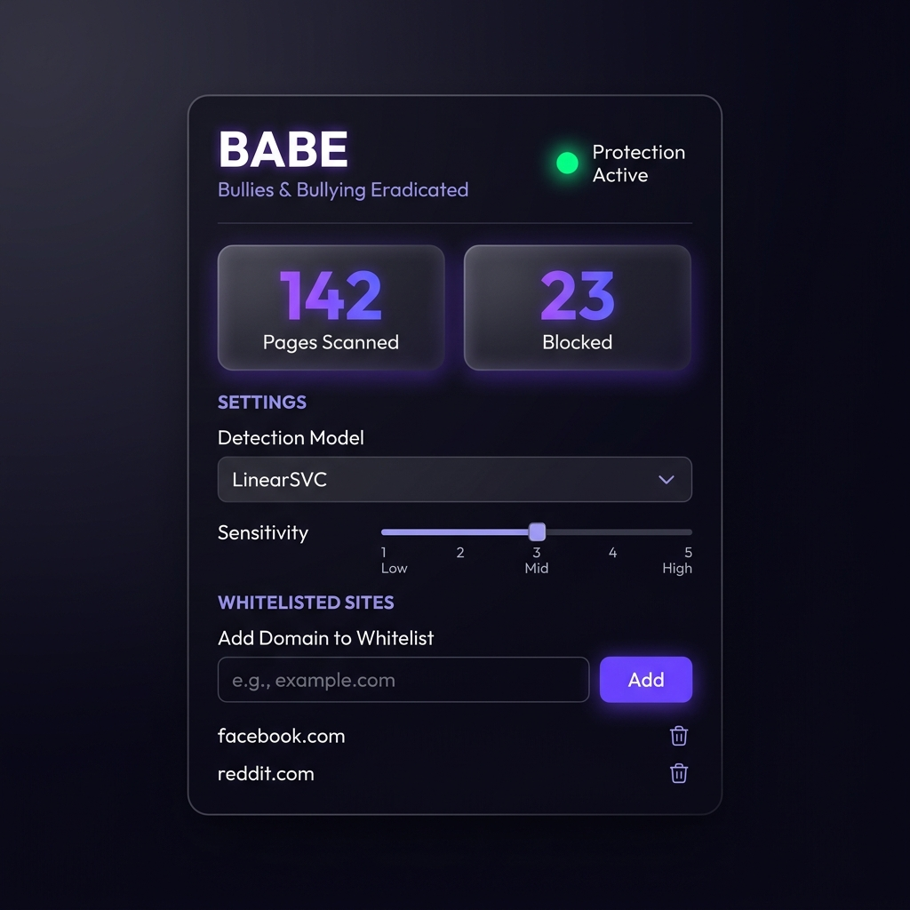
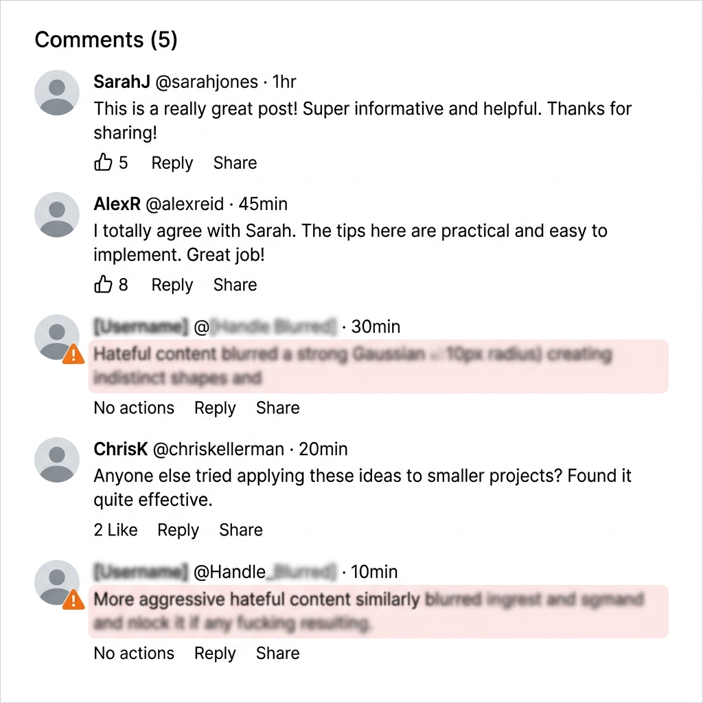

<p align="center">
  
</p>

<h1 align="center">B.A.B.E — Bullies & Bullying Eradicated</h1>

<p align="center">
  <strong>A Chrome Extention that detects and censors cyberbullying & hate speech in real-time using machine learning — 100% client-side and privacy-first.</strong>
</p>

<p align="center">
  
  
  
  
  
</p>

<br />

<p align="center">
  
  &nbsp;&nbsp;&nbsp;
  
</p>

<p align="center">
  <em>Left: Control panel dashboard &nbsp;•&nbsp; Right: Abusive text detected and blurred in real-time</em>
</p>

---

## ✨ Features

| Feature | Description |
|---------|-------------|
| 🛡️ **Real-time Detection** | Scans every web page as you browse and flags abusive/hate-speech content |
| 🔒 **100% Privacy** | All ML inference happens locally in your browser — no data ever leaves your machine |
| 🌫️ **Smart Blur Censoring** | Detected content is blurred with a smooth CSS filter — hover to reveal |
| 🤖 **Dual ML Models** | Choose between **LinearSVC** (97.3% accuracy) or **Logistic Regression** (93.6% accuracy) |
| 🎚️ **Adjustable Sensitivity** | Fine-tune the detection threshold from lenient to aggressive |
| 📋 **Domain Whitelist** | Exclude trusted sites from scanning |
| 📊 **Live Statistics** | Track pages scanned and sentences blocked in the dashboard |
| ⚡ **Performance Optimized** | Batched DOM scanning with `requestAnimationFrame` — zero UI jank |
| 🔄 **Dynamic Content** | `MutationObserver` catches new content on social media feeds (Twitter, Reddit, etc.) |
| 🌐 **Works Offline** | No internet connection required for detection |

---

## 🏗️ Architecture

```
┌─────────────────────────────────────────────────────┐
│                    Chrome Browser                    │
│                                                     │
│  ┌───────────────┐  messages  ┌──────────────────┐  │
│  │ Content Script │◄─────────►│  Service Worker   │  │
│  │               │           │                  │  │
│  │ • Tokenizer   │           │ • Stats tracking │  │
│  │ • TF-IDF      │           │ • Badge updates  │  │
│  │ • SVM predict │           │ • Settings sync  │  │
│  │ • DOM blur    │           └──────────────────┘  │
│  │ • Observer    │                    ▲             │
│  └───────────────┘                    │             │
│         ▲                      chrome.storage       │
│         │                             │             │
│    model_data.json             ┌──────┴─────────┐   │
│    (exported weights)          │  Popup Panel    │   │
│                                │ • Toggle on/off │   │
│                                │ • Model select  │   │
│                                │ • Sensitivity   │   │
│                                │ • Whitelist     │   │
│                                └────────────────┘   │
└─────────────────────────────────────────────────────┘
```

### How It Works

1. **Model Export** — A Python script extracts the trained SVM/LR coefficients and TF-IDF vocabulary from `.pkl` files into a single compact JSON (~1 MB)
2. **Content Script** — On every page load, the script tokenizes visible text, computes TF-IDF vectors, and runs a dot-product prediction against the exported model weights
3. **Censoring** — Text nodes scoring above the threshold are wrapped in a `<span>` with `filter: blur(5px)` and a ⚠️ indicator
4. **Live Updates** — A `MutationObserver` watches for dynamically loaded content (infinite scroll feeds) and scans new nodes automatically

---

## 🚀 Quick Start

### Prerequisites

- **Google Chrome** (or any Chromium-based browser)
- **Python 3.8+** (only needed if you want to re-export the model)

### Installation

1. **Clone the repo**
   ```bash
   git clone https://github.com/JatinAggarwal5320/Cyber-Bullying-Detection.git
   cd Cyber-Bullying-Detection
   ```

2. **Load the extension in Chrome**
   - Open `chrome://extensions/`
   - Enable **Developer mode** (toggle in top-right)
   - Click **Load unpacked**
   - Select the `babe_extension/` folder

3. **Done!** The BABE shield icon appears in your toolbar. Click it to open the dashboard.

---

## 📁 Project Structure

```
Cyber-Bullying-Detection/
│
├── 📓 Abuse Detection.ipynb     # Jupyter notebook — EDA, training, evaluation
├── 📊 dataset.csv               # 18,000+ labeled tweets (bullying vs non-bullying)
├── 📝 stopwords.txt             # Custom stopword list for text preprocessing
├── 🐍 app.py                    # Original Flask web app (legacy)
├── 🔧 export_model.py           # Exports sklearn models → JSON for the extension
├── 🎨 generate_icons.py         # Generates shield icons via PIL
│
├── 📦 models/                   # Pre-trained sklearn model files
│   ├── LinearSVC.pkl            # ⭐ Best performer (97.3% test accuracy)
│   ├── LinearSVCTuned.pkl       # Hyperparameter-tuned variant
│   ├── LogisticRegression.pkl   # Runner-up (93.6% test accuracy)
│   ├── MultinomialNB.pkl
│   ├── DecisionTreeClassifier.pkl
│   ├── BaggingClassifier.pkl
│   ├── AdaBoostClassifier.pkl
│   ├── SGDClassifier.pkl
│   └── tfidfvectoizer.pkl       # TF-IDF vocabulary (31,683 terms)
│
├── 🌐 templates/
│   └── index.html               # Flask template (legacy web UI)
│
└── 🛡️ babe_extension/           # Chrome Extension (Manifest V3)
    ├── manifest.json
    ├── model_data.json           # Exported model weights (~1 MB)
    ├── icons/
    │   ├── icon-16.png
    │   ├── icon-48.png
    │   └── icon-128.png
    ├── background/
    │   └── service-worker.js     # Stats, badges, message routing
    ├── content/
    │   ├── content.js            # ML prediction + DOM scanning + blur
    │   └── content.css           # Blur animation styles
    └── popup/
        ├── popup.html            # Dashboard UI
        ├── popup.css             # Dark glassmorphism theme
        └── popup.js              # Settings management
```

---

## 📈 Model Performance

Trained on **36,296 labeled tweets** (80/20 train-test split) using TF-IDF vectorization with a custom stopword list.

| Model | Test Accuracy | F1 Score | Precision | Recall | Training Time |
|-------|:------------:|:--------:|:---------:|:------:|:-------------:|
| **LinearSVC** ⭐ | **96.47%** | **0.9727** | 0.9739 | 0.9714 | 0.42s |
| LogisticRegression | 93.64% | 0.9505 | 0.9556 | 0.9455 | 0.60s |
| SGDClassifier | 93.61% | 0.9500 | 0.9602 | 0.9401 | 0.11s |
| DecisionTreeClassifier | 97.30% | 0.9793 | 0.9707 | 0.9881 | 11.28s |
| BaggingClassifier | 97.04% | 0.9772 | 0.9744 | 0.9800 | 69.58s |
| MultinomialNB | 89.92% | 0.9254 | 0.8866 | 0.9678 | 0.02s |
| AdaBoostClassifier | 76.74% | 0.8426 | 0.7488 | 0.9634 | 7.04s |

> **LinearSVC** was chosen as the default model for the extension due to its excellent balance of accuracy, speed, and compact weight size.

---

## 🔧 Re-exporting the Model

If you retrain the models or want to regenerate the extension assets:

```bash
# Export model weights to JSON
python3 export_model.py

# Regenerate extension icons
python3 generate_icons.py
```

**Dependencies for export:**
```bash
pip install scikit-learn numpy Pillow
```

---

## 🛠️ Tech Stack

| Layer | Technology |
|-------|-----------|
| **ML Training** | Python, scikit-learn, pandas, TF-IDF |
| **Extension** | Chrome Manifest V3, vanilla JavaScript |
| **UI** | HTML5, CSS3 (glassmorphism), Google Fonts (Outfit) |
| **Background** | Service Worker (chrome.storage API) |
| **Content** | MutationObserver, requestAnimationFrame batching |

---

## 🤝 Contributing

Contributions are welcome! Here are some ideas:

- [ ] Add support for more languages (Hindi, Spanish, etc.)
- [ ] Integrate a transformer-based model (DistilBERT) via ONNX.js
- [ ] Add a "Report" button to flag false positives/negatives
- [ ] Build a Firefox/Edge compatible version
- [ ] Add right-click context menu for on-demand text analysis

```bash
# Fork the repo, create a branch, make changes, then:
git checkout -b feature/your-feature
git commit -m "feat: add your feature"
git push origin feature/your-feature
# Open a Pull Request
```

---

## 📜 License

This project is open source and available under the [MIT License](LICENSE).

---

<p align="center">
  <strong>Built with 💜 to make the internet a safer place.</strong>
  <br />
  <sub>If this project helped you, consider giving it a ⭐</sub>
</p>
